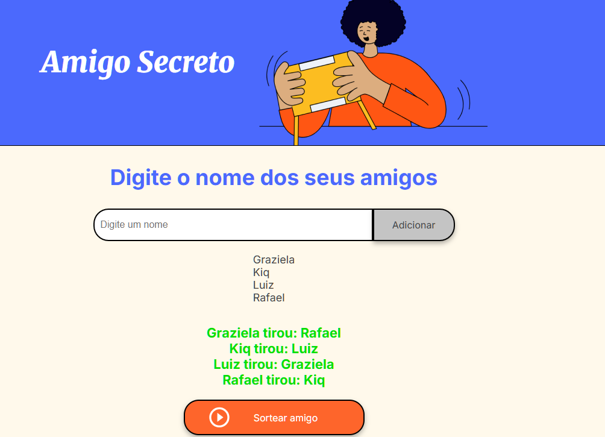

# 🎅 Amigo Secreto - Projeto de Lógica JavaScript

Um sorteio de amigo secreto totalmente funcional desenvolvido com JavaScript puro, focado na aplicação prática de conceitos fundamentais de programação.



## 🚀 Funcionalidades Principais

- **Adição dinâmica de participantes**  
  Validação em tempo real para nomes vazios e duplicados
- **Sorteio inteligente**  
  Algoritmo que evita auto-sorteio e garante combinações válidas
- **Interface intuitiva**  
  Atualização em tempo real da lista de participantes
- **Resultados claros**  
  Exibição organizada dos pares sorteados
- **Design responsivo**  
  Compatível com diferentes tamanhos de tela

## ⚙️ Tecnologias Utilizadas

- **HTML** - Estrutura 
- **CSS** - Estilização moderna com variáveis e Flexbox
- **JavaScript** - Lógica pura sem bibliotecas externas

## 📥 Instalação e Uso

1. **Clone o repositório**
   ```bash
   git clone https://github.com/LuizGPatury/Desafio-Amigo-Secreto